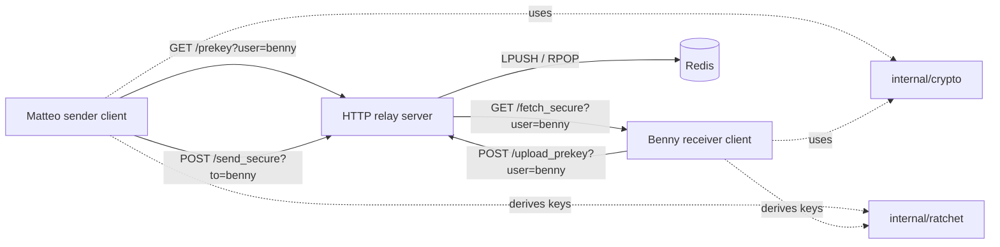

# MetaChat

## Extended Triple Diffie-Hellman & Double Ratchet in Go

**University Project Report**

**Creators**

- Mehdi Talebikhatir (ID: 558948)
- Benyamin Baharizadeh (ID: 560587)

**Repository:** <https://github.com/mehditalebi01/metachat>  
**Date:** April 27, 2026  
**Main purpose:** educational end-to-end encrypted messaging in Go.

---

## Abstract / Executive Summary

MetaChat is a small secure messaging project written in Go. It shows how two users can exchange an encrypted message through a server that does not know the plaintext. The project uses X25519 Diffie-Hellman, HKDF-SHA256, a Double Ratchet-inspired key chain, AES-256-GCM, and Redis.

The implementation is educational. It studies the ideas behind Extended Triple Diffie-Hellman and the Double Ratchet, but it is not a complete production Signal Protocol implementation. In the current code, Benny publishes one X25519 public key, Matteo creates a fresh ephemeral key, both sides derive the same message key, and the server stores only public keys, nonces, and ciphertext.

---

## Introduction

Secure messaging is important because a normal server-based chat gives too much power to the server. If the server stores plaintext, then a server leak or a dishonest administrator can read messages. End-to-end encryption avoids this by keeping the message content encrypted until it reaches the receiver device.

MetaChat demonstrates this idea with a small client-server-client design:

- `benny/main.go`: receiver client.
- `matteo/main.go`: sender client.
- `server/main.go`: HTTP relay server backed by Redis.
- `internal/crypto/crypto.go`: X25519, HKDF, AES-GCM.
- `internal/ratchet/ratchet.go`: root key, chain key, and message key derivation.

The demo users in the code are Matteo and Benny. The project creators are Mehdi Talebikhatir and Benyamin Baharizadeh.

### Scope note

The project name refers to Extended Triple Diffie-Hellman and the Double Ratchet family. The current repository implements a simplified X3DH-inspired handshake. Full X3DH normally includes identity keys, signed prekeys, one-time prekeys, signatures, and identity verification. This project keeps the design smaller so the main ideas are clear in code.

---

## Activities

| Activity | What was done |
|---|---|
| Repository design | The project was split into sender, receiver, server, crypto, and ratchet packages. |
| Key generation | X25519 private and public keys are generated. |
| Key agreement | Matteo and Benny compute the same shared secret using Diffie-Hellman. |
| Key derivation | HKDF-SHA256 derives root keys, chain keys, and message keys. |
| Encryption | AES-256-GCM encrypts and authenticates the plaintext. |
| Relay server | HTTP endpoints store prekeys and encrypted messages in Redis. |
| End-to-end run | The server, Benny client, and Matteo client were executed and the decrypted output was checked. |

---

## System Architecture



The server is not trusted with plaintext. It stores only:

- `prekey:benny`: Benny's public key bundle.
- `secure_mailbox:benny`: encrypted message queue.

---

## Step-by-Step Protocol Walkthrough

### 1. Benny publishes a public key

Benny generates an X25519 key pair:

```text
(bennyPriv, bennyPub)
```

The private key stays inside Benny's process. The public key is uploaded to the server and stored as:

```text
prekey:benny
```

### 2. Matteo fetches Benny's public key

Matteo calls:

```text
GET /prekey?user=benny
```

If Benny has not uploaded a key, Matteo stops.

### 3. Matteo creates an ephemeral key

Matteo creates a fresh key pair for this message:

```text
(matteoPriv, matteoPub)
```

The public part is sent with the encrypted message.

### 4. Both sides compute the same shared secret

Matteo computes:

```text
S = DH(matteoPriv, bennyPub)
```

Benny computes:

```text
S = DH(bennyPriv, matteoPub)
```

Both values are the same. The server never sees `S`.

### 5. The ratchet derives a message key

```text
root_key  = HKDF(shared_secret, "root")
chain_key = HKDF(root_key, "chain")
chain_key = HKDF(chain_key, "chain-step")
msg_key   = HKDF(chain_key, "msg")
```

`msg_key` is 32 bytes, so it can be used with AES-256-GCM.

### 6. Matteo encrypts and sends

Matteo sends this structure to the server:

```go
type SecureMessage struct {
    FromIdentity []byte `json:"from_identity"`
    EphemeralKey []byte `json:"ephemeral_key"`
    Nonce        []byte `json:"nonce"`
    Ciphertext   []byte `json:"ciphertext"`
}
```

### 7. Benny fetches and decrypts

Benny polls the mailbox, computes the same message key, and decrypts the ciphertext.

---

## Real Code Evidence

### X25519 key exchange

```go
func GenerateKeyPair() (priv, pub []byte) {
    priv = make([]byte, 32)
    rand.Read(priv)
    pub, _ = curve25519.X25519(priv, curve25519.Basepoint)
    return
}

func DH(priv, pub []byte) []byte {
    shared, _ := curve25519.X25519(priv, pub)
    return shared
}
```

### HKDF and AES-GCM

```go
func HKDF(secret []byte, info string) []byte {
    h := hkdf.New(sha256.New, secret, nil, []byte(info))
    out := make([]byte, 32)
    io.ReadFull(h, out)
    return out
}

func Encrypt(key, plaintext []byte) (nonce, ciphertext []byte) {
    block, _ := aes.NewCipher(key)
    gcm, _ := cipher.NewGCM(block)
    nonce = make([]byte, gcm.NonceSize())
    rand.Read(nonce)
    ciphertext = gcm.Seal(nil, nonce, plaintext, nil)
    return
}
```

### Ratchet message key

```go
func (r *Ratchet) NextMessageKey() []byte {
    r.ChainKey = crypto.HKDF(r.ChainKey, "chain-step")
    return crypto.HKDF(r.ChainKey, "msg")
}
```

### Matteo sender flow

```go
matteoPriv, matteoPub := crypto.GenerateKeyPair()

shared := crypto.DH(matteoPriv, bundle.IdentityKey)
r := ratchet.NewRatchet(shared, bundle.IdentityKey)
msgKey := r.NextMessageKey()

nonce, ciphertext := crypto.Encrypt(msgKey, []byte(message))
```

### Benny receiver flow

```go
shared := crypto.DH(bennyPriv, msg.EphemeralKey)
r := ratchet.NewRatchet(shared, msg.EphemeralKey)
msgKey := r.NextMessageKey()

plaintext := crypto.Decrypt(msgKey, msg.Nonce, msg.Ciphertext)
```

---

## Results & Discussion

### Package check

The repository compiled successfully with:

```text
go test ./...
```

Output:

```text
?       metachat/benny              [no test files]
?       metachat/internal/crypto    [no test files]
?       metachat/internal/ratchet   [no test files]
?       metachat/matteo             [no test files]
?       metachat/server             [no test files]
```

### End-to-end demo output

Redis was not installed on this machine, so the real Go programs were run against a small local Redis-compatible test relay that supports only the commands used by this project. The Go project code was not changed.

Server:

```text
[SERVER] Running on :8080 (Redis: localhost:6379)
[SERVER] Stored prekey bundle for benny (Redis key: prekey:benny)
[SERVER] Served prekey bundle for benny
[SERVER] Queued secure message for benny (Redis list: secure_mailbox:benny)
[SERVER] Delivered 1 secure message to benny
```

Matteo:

```text
[MATTEO] Message from CLI args: Hello Benny, this is a secure MetaChat demo for the university report.
[MATTEO] Fetching Benny prekey from server...
[MATTEO] Benny prekey received.
[MATTEO] Generating Matteo ephemeral X25519 keypair...
[MATTEO] Computing shared secret (X25519 DH)...
[MATTEO] Initializing ratchet and deriving message key...
[MATTEO] Encrypting message with AES-GCM...
[MATTEO] Sending encrypted message to server (queued for benny in Redis)...
[MATTEO] Done. Message sent.
```

Benny:

```text
[BENNY] Generating Benny X25519 identity keypair...
[BENNY] Uploading Benny public key to server (stored in Redis as prekey:benny)...
[BENNY] Benny ready. Polling mailbox from server (secure_mailbox:benny in Redis)...
[BENNY] Received encrypted message. Deriving shared secret (X25519 DH)...
[BENNY] Initializing ratchet and deriving message key...
[BENNY] Decrypting with AES-GCM...
[BENNY] Benny received: Hello Benny, this is a secure MetaChat demo for the university report.
```

The result is correct. The server logs show only key storage, ciphertext queueing, and delivery. The plaintext appears only in Matteo's local input and Benny's final output.

### What worked well

- The project has clear files and responsibilities.
- The server does not need private keys or plaintext.
- X25519 and AES-GCM are good choices for a small secure messaging demo.
- Redis lists match the idea of a mailbox.
- The protocol is easy to follow for learning.

### Limitations

| Limitation | Explanation |
|---|---|
| Simplified X3DH | The code does not yet include signed prekeys, one-time prekeys, or signatures. |
| Partial Double Ratchet | The ratchet creates message keys, but full send/receive state and skipped keys are not implemented. |
| No identity verification | Users do not compare fingerprints or safety numbers. |
| No replay protection | There are no message counters or replay checks. |
| No TLS | The relay uses plain HTTP. |
| Crypto errors ignored | Some errors from randomness, X25519, and AES-GCM are not checked. |
| No key persistence | Keys are regenerated each run. |

---

## Conclusion

MetaChat successfully demonstrates the core idea of end-to-end encrypted messaging. Matteo and Benny can derive the same message key without sending the key to the server. The server is useful for delivery, but it does not decrypt messages.

The project is a good academic prototype because the important parts are visible: key generation, Diffie-Hellman, HKDF, ratcheting, AES-GCM, and a mailbox server. The next step would be to complete the X3DH and Double Ratchet design with signed prekeys, one-time prekeys, identity verification, replay protection, and stronger error handling.

---

## Appendix A: Modern Messengers Today

Most modern messengers use a server for routing and a client-side protocol for message content security.

- Signal documents X3DH for asynchronous key agreement and the Double Ratchet for fresh message keys.
- WhatsApp and Messenger use Signal Protocol ideas for end-to-end encrypted personal communication, and Meta has published work on key transparency.
- Telegram is different: normal cloud chats are server-synced, while Secret Chats are the end-to-end encrypted mode and are device-specific.

MetaChat is a small version of these ideas. It publishes public keys, relays encrypted messages, derives message keys on clients, and avoids giving the server plaintext.

---

## Appendix B: API Endpoints

| Method | Endpoint | Query | Purpose |
|---|---|---|---|
| POST | `/upload_prekey` | `user` | Upload a user's public key bundle. |
| GET | `/prekey` | `user` | Fetch a user's public key bundle. |
| POST | `/send_secure` | `to` | Queue an encrypted message. |
| GET | `/fetch_secure` | `user` | Pop the next encrypted message. |

---

## Appendix C: Redis Keys

| Redis key | Type | Meaning |
|---|---|---|
| `prekey:<user>` | String | JSON public key bundle. |
| `secure_mailbox:<user>` | List | Encrypted messages waiting for the user. |

---

## References

1. Signal, The X3DH Key Agreement Protocol: <https://signal.org/docs/specifications/x3dh/>
2. Signal, The Double Ratchet Algorithm: <https://signal.org/docs/specifications/doubleratchet/>
3. Meta Engineering, Deploying key transparency at WhatsApp: <https://engineering.fb.com/2023/04/13/security/whatsapp-key-transparency/>
4. Telegram, End-to-End Encryption, Secret Chats: <https://core.telegram.org/api/end-to-end>
5. Go package documentation, `golang.org/x/crypto/curve25519`: <https://pkg.go.dev/golang.org/x/crypto/curve25519>
